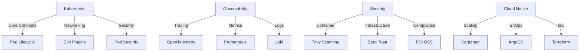

# Hi there, I'm Dhaval Shah 👋

  
  
  
   
  
  
  

## 🔥 Tech Stack & Tools

  
  <!-- Cloud -->
  
  
  
  
  <!-- Containers & Orchestration -->
  
  
  
  
  <!-- Observability -->
  
  
  
  
  
  
  <!-- Security -->
  
  
  
  
  <!-- IaC & GitOps -->
  
  
  
  
  <!-- Languages -->
  
  
  
  
  

## 🌟 My Observability & K8s Universe

  <picture>
    <source media="(prefers-color-scheme: dark)" srcset="https://raw.githubusercontent.com/dhaval512/dhaval512/main/assets/darkmode.svg">
    <source media="(prefers-color-scheme: light)" srcset="https://raw.githubusercontent.com/dhaval512/dhaval512/main/assets/lightmode.svg">
    
  </picture>

## 📊 GitHub Stats

  <table>
    <tr>
      <td valign="top" width="50%">
        
      </td>
      <td valign="top" width="50%">
        
      </td>
    </tr>
  </table>

## 🚀 What I'm Currently Building

  
  

## 🎓 What I'm Teaching & Sharing

## 🌐 Connect With Me

  
  
  
  

## 🌟 When I'm Not Coding...

  
  
  
  
  Exploring the world through my camera lens, analyzing market trends, and finding balance through spiritual practices.

---

  

