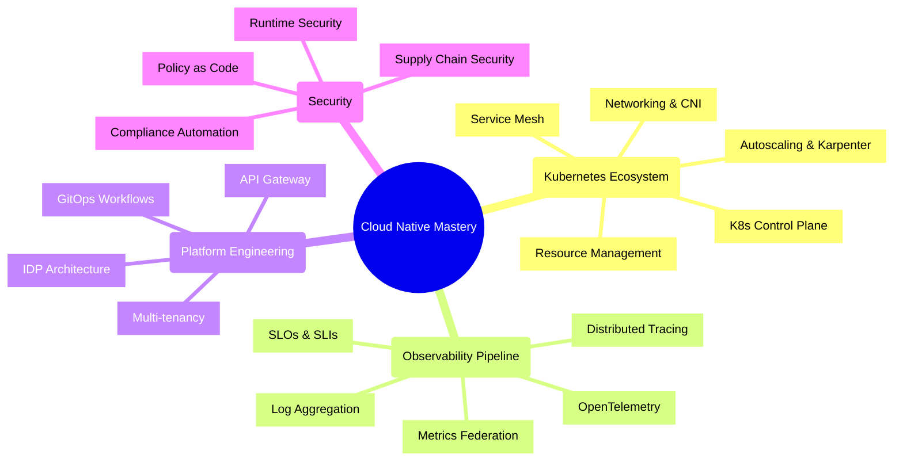

# 👨‍💻 Dhaval Shah | Code, Cloud & Kubernetes

<div align="center">
  
  
  
  <br/>
  
  
  
</div>

## 🛠️ Tech Arsenal

<div align="center">
  <table>
    <tr>
      <td><b>☁️ Cloud Native</b></td>
      <td>
        <a href="#"></a>
        <a href="#"></a>
        <a href="#"></a>
        <a href="#"></a>
        <a href="#"></a>
        <a href="#"></a>
        <a href="#"></a>
      </td>
    </tr>
    <tr>
      <td><b>📊 Observability</b></td>
      <td>
        <a href="#"></a>
        <a href="#"></a>
        <a href="#"></a>
        <a href="#"></a>
        <a href="#"></a>
        <a href="#"></a>
        <a href="#"></a>
      </td>
    </tr>
    <tr>
      <td><b>🔒 Security & Compliance</b></td>
      <td>
        <a href="#"></a>
        <a href="#"></a>
        <a href="#"></a>
        <a href="#"></a>
        <a href="#"></a>
        <a href="#"></a>
      </td>
    </tr>
    <tr>
      <td><b>🏗️ IaC & GitOps</b></td>
      <td>
        <a href="#"></a>
        <a href="#"></a>
        <a href="#"></a>
        <a href="#"></a>
        <a href="#"></a>
      </td>
    </tr>
    <tr>
      <td><b>☁️ Hyperscalers</b></td>
      <td>
        <a href="#"></a>
        <a href="#"></a>
        <a href="#"></a>
      </td>
    </tr>
    <tr>
      <td><b>💻 Languages</b></td>
      <td>
        <a href="#"></a>
        <a href="#"></a>
        <a href="#"></a>
        <a href="#"></a>
        <a href="#"></a>
      </td>
    </tr>
    <tr>
      <td><b>⚙️ Runtime</b></td>
      <td>
        <a href="#"></a>
        <a href="#"></a>
        <a href="#"></a>
        <a href="#"></a>
        <a href="#"></a>
      </td>
    </tr>
  </table>
</div>

## 🔬 Core Focus Areas



## 📊 GitHub Activity

<div align="center">
  
  
  
  
  
</div>

## 🔭 Current Engineering Focus

```go
package main

import (
	"fmt"
	"time"
)

type Project struct {
	Name        string
	Technology  string
	Description string
}

func main() {
	projects := []Project{
		{
			Name:        "Observability Pipeline",
			Technology:  "OpenTelemetry + Tempo + Prometheus",
			Description: "Building scalable distributed tracing & metrics collection",
		},
		{
			Name:        "Kubernetes Autoscaling",
			Technology:  "Karpenter + KEDA",
			Description: "Intelligent pod scheduling & event-driven autoscaling",
		},
		{
			Name:        "Supply Chain Security",
			Technology:  "Trivy + Cosign + SBOM",
			Description: "Implementing end-to-end container security scanning",
		},
		{
			Name:        "GitOps Workflow",
			Technology:  "ArgoCD + Crossplane + Kustomize",
			Description: "Declarative infrastructure & application delivery",
		},
	}

	for _, p := range projects {
		buildProject(p)
	}
}

func buildProject(p Project) {
	fmt.Printf("🚀 Working on: %s using %s\n", p.Name, p.Technology)
	time.Sleep(time.Millisecond * 100) // Building in progress...
	fmt.Printf("✅ Goal: %s\n\n", p.Description)
}
```

## 🧠 Knowledge Base & Resources

<div align="center">
  <table>
    <tr>
      <td>
        <strong>💬 Ask me about:</strong>
        <ul>
          <li>Distributed systems architecture</li>
          <li>Kubernetes resource optimization</li>
          <li>Observability pipeline design</li>
          <li>Zero-trust infrastructure</li>
          <li>SRE implementation & SLOs</li>
        </ul>
      </td>
      <td>
        <strong>📚 Learning path:</strong>
        <ul>
          <li>eBPF programming</li>
          <li>Rust for systems programming</li>
          <li>Cost optimization strategies</li>
          <li>Multi-cluster federation</li>
          <li>AI/ML in infrastructure</li>
        </ul>
      </td>
    </tr>
  </table>
</div>

## 🌐 Connect & Collaborate

<div align="center">
  <a href="https://twitter.com/yourusername">
    
  </a>
  <a href="https://www.linkedin.com/in/yourusername/">
    
  </a>
  <a href="mailto:dhavalshah512@proton.me">
    
  </a>
</div>

<div align="center">
  <h3>⚡ Beyond the Terminal</h3>
  <table>
    <tr>
      <td align="center"></td>
      <td>Market analysis & quantitative trading</td>
    </tr>
    <tr>
      <td align="center"></td>
      <td>Technical photography & image processing</td>
    </tr>
    <tr>
      <td align="center"></td>
      <td>Mindfulness practices & cognitive optimization</td>
    </tr>
  </table>
</div>

---

<div align="center">
  
  
  <br/>
  <sub>Systems break. Coffee helps. Kubernetes heals.</sub>
</div>
